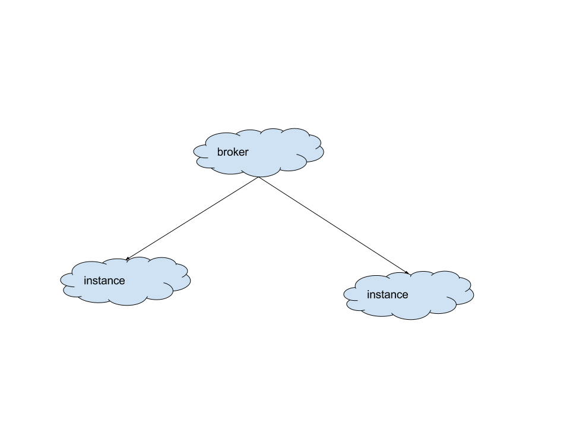
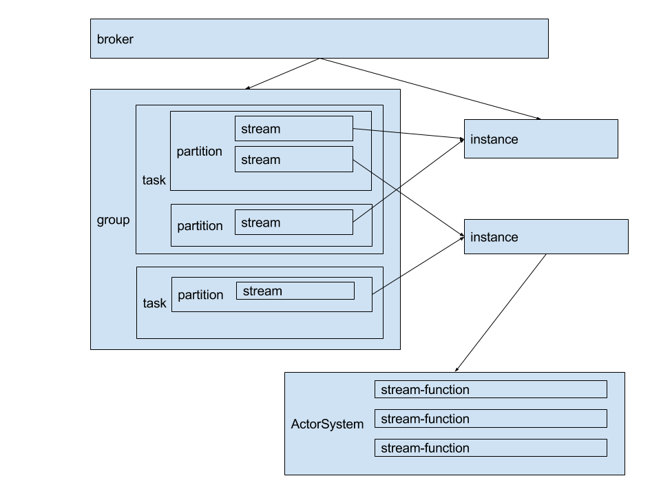

# Teleporter

**Teleporter** is a realtime dynamic data process frameworks. It's follow [reactive-streams](https://github.com/reactive-streams/reactive-streams-jvm) specification, use [akka-streams](https://github.com/akka/akka) as data process engine, So it have a high performance for a single streams, It's based on akka, so single machine can support thousands streams, and it's provider a distributed manager, so a cluster can support millions streams.

Now support: kafka, jdbc, kudu, mongo, elasticsearch, hdfs, hbase

### Quickstart
 * broker
   > Is a config manager, task manager. It's contains a ui, default:(http://localhost:9021)
 * instance
   > The execute engine, for run data process task.

##### UI config
 - namespace
    - broker - define all broker, for master-master
    - instance - Every instance must have a unique key
    - group - many-to-many for task and instance relation
    - task - It contain many streams
        + partition - Split task use tail regex for task streams, like: `/stream/ns/task/stream11.*`
        + stream - the real task execute unit, default is a scala script write by akka-streams.
            * source - akka-steams source, or like jdbc,kafka source for data read
            * sink - akka-streams sink, for data write
    - address - data address, like database, kafka...
    - variable - a public variable refer
    
### [Rest API](docs/rest_api.md)
 
All node can refresh, and all instance will be dynamic refresh.
User defined exception process. Pattern `errorMessage Regex match : (DEBUG|INFO|WARN|ERROR) => Action`
action rule like `retry(delay = 1.minutes, retries = 3, next = stop)`
support main process rules:
- stream
    > start, stop, restart
- source
    > reload, retry, resume, stop
- sink
    > reload, retry, resume, stop
    
Next will collect error metrics on UI for monitor.

### Install
for linux:
```bash
/bin/teleporter.sh start broker
```
It's will auto find config from broker and run it, All can config, You don't write any logic in this.
```bash
/bin/teleporter.sh start instance
```
or for local dev
```bash
/bin/teleporter.sh start local
```
dev ui:
[ui install](ui/README.md)
```bash
ng serve --proxy-config proxy.conf.json
```

#####broker
It's contains config manager, streams dynamic updated, It's use a scala script for a streams logic which write In akka streams, Only implement a function:
`(key: String, center: TeleporterCenter) ⇒ (KillSwitch, Future[Done])`, like this:
```scala
object StreamExample extends StreamLogic {
  override def apply(key: String, center: TeleporterCenter): (KillSwitch, Future[Done]) = {
    import center.{materializer, self}
    Jdbc.sourceAck("/source/ns/task/stream/source")
      .map(_.map(data ⇒ Seq(Upsert(
        updateSql("table_name", "id", data),
        insertIgnoreSql("table_name", data)
      ))).toMessage)
      .viaMat(KillSwitches.single)(Keep.right).watchTermination()(Keep.both)
      .via(Jdbc.flow("/source/ns/task/stream/sink"))
      .to(SourceAck.confirmSink())
      .run()
  }
}
```
Or it's can make a template for zero code. And other standrd config is defined on UI, So it's easy config. UI use [angular2 dynamic form](https://angular.io/docs/ts/latest/cookbook/dynamic-form.html), So it's add config UI by config.Every client only use one tcp connection for all thing with broker for high performance. Every client keep connection for multi broker and don't have a master for high available. Don't use listener for config change event. Use the trigger for change. The store is easy change. Because config is only use KV store. change store only implement one interface only 4 method. Default use leveldb, but it's easy use other database.
Metrics use influxdb show as chartjs, this statistics rate, error count etc.

#### Instance
instance is only a executor streams. Write back state. Give the instance a unique key, and then config the relation for task on UI. It's will auto exec.

#### Rest Api

##About
The idea from camel and spring integration,  and I will use akka-streaming, reactive-streams-jvm
Every stream has source, flow, sink. source sink is elso the publisher and subscribe.
So I will make every thing like this. **simple,flexibility and powerful**.

### Diagram

